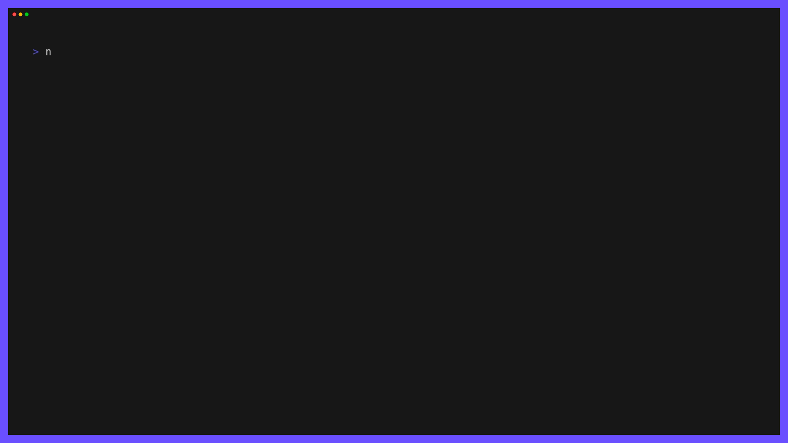

# Nori
Nori allows you to package, distribute and deploy your Terraform modules. Nori creates oci compatible images that can be tagged and pushed to any container registry. such as AWS ECR, Github Packages or Docker Hub. With nori you can easily deploy any terraform module with a single command.



## Getting Started
To get started with Nori, you need to install the Nori CLI. You can install the CLI by running the following command:
```bash
go install https://github.com/eunanhardy/nori@v0.0.1
```

Setup your Nori configuration file by running the following command:
```bash
nori init
```
Setup your Nori config to use S3 as a backend:
```bash
nori init --backend s3://com.mycompany.terraform --backend-region eu-west-1
```

## Usage
### Login
Example of login to a AWS ECR registry:
```bash
nori login --username AWS --password $(aws ecr get-login-password --region eu-west-1) 123456789012.dkr.ecr.eu-west-1.amazonaws.com
```

### Deploy
To Deploy your Terraform module, run the following command:
```bash
nori deploy 123456789012.dkr.ecr.eu-west-1.amazonaws.com/create-s3-bucket:v1 --values ./values.yaml
```
### Plan
To create a preview of your module deployment, run the following command:
```bash
nori plan 123456789012.dkr.ecr.eu-west-1.amazonaws.com/create-s3-bucket:v1 --values ./values.yaml
```
### Package
To package your Terraform module provide a valid tag and path to your module directory , run the following command:
```bash
nori package --tag 123456789012.dkr.ecr.eu-west-1.amazonaws.com/create-s3-bucket:v1 ./modules/s3-bucket
```
### Push/Pull
To push your packaged module to a container registry, run the following command:
```bash
nori push 123456789012.dkr.ecr.eu-west-1.amazonaws.com/create-s3-bucket:v1
```

To pull your packaged module from a container registry, run the following command:
```bash
nori pull 123456789012.dkr.ecr.eu-west-1.amazonaws.com/create-s3-bucket:v1
```
